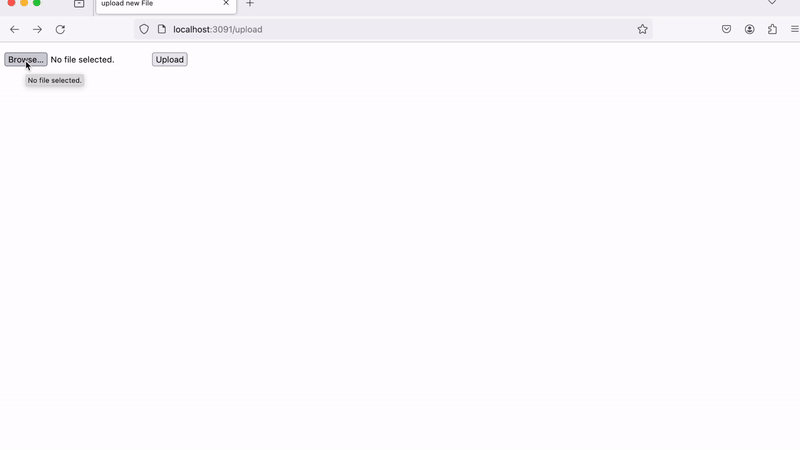

# Building a Fullstack web service using Docker, SQL, and Flask

This project builds a simple website capable of uploading static media files including images and text files. This website is based of the Instagram Tech stack. It is built using Flask and is deployed with Docker containers for Postgres, Gunicorn, and nginx. Using this repo, you can upload an image on http://localhost:13371/upload and then view the images in http://localhost:13371/media/


The gif shows a different port since I used port forwarding to access http://localhost:13371 on my local computer

## 1. Environment Files
 
Once the repo is installed, the first step is creating the .env files. For the production and dev, create a .env.dev and .env.prod file in the root directory that contains your environment variables:
```
FLASK_APP=project/__init__.py
FLASK_DEBUG=0
DATABASE_URL=
SQL_HOST=db
SQL_PORT=5432
DATABASE=postgres
APP_FOLDER=/home/app/web
```
Then you will create a .env.prod.db file fir the database:
```
POSTGRES_USER=
POSTGRES_PASSWORD=
POSTGRES_DB=
```

## 2. Developement
 
The next step is building the docker images and running the containers for the development. This is done using the following commands:
```
$ docker-compose up -d --build
```
```
$ docker-compose exec web python manage.py create_db
```
You can verify that the file is working as expected by visiting http://localhost:13371 and check that it is showing `{"hello", "world"}`
After testing the Developement, you can bring down the containers using
```
$ docker-compose down -v
```


## 3. Production
For production, you can build and run the production images using:
```
$ docker-compose -f docker-compose.prod.yml up -d --build
```
```
$ docker-compose -f docker-compose.prod.yml exec web python manage.py create_db
```
Once your containers are up, your site should be accessible at http://localhost:13371
You can upload files at http://localhost:13371/upload and view your files at http://localhost:13371/media/filname

